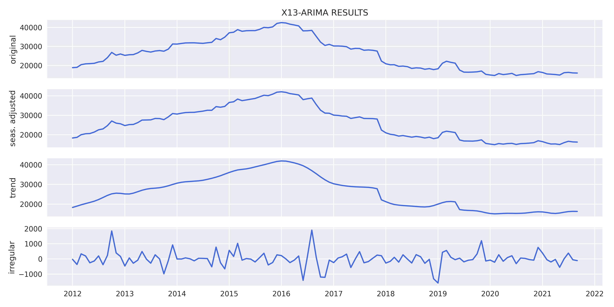
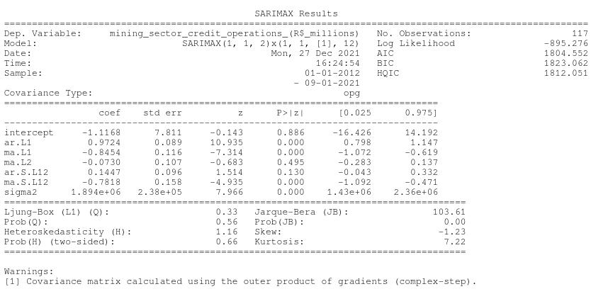

# **DESCRIPTION**
Mining is the extraction of valuable minerals or other geological materials from the Earth, usually from an ore body, lode, vein, seam, reef, or placer deposit. Exploitation of these deposits for raw material is based on the economic viability of investing in the equipment, labor, and energy required to extract, refine and transport the materials found at the mine to manufacturers who can use the material.
Ores recovered by mining include metals, coal, oil shale, gemstones, limestone, chalk, dimension stone, rock salt, potash, gravel, and clay. Mining is required to obtain most materials that cannot be grown through agricultural processes, or feasibly created artificially in a laboratory or factory. Mining in a wider sense includes extraction of any non-renewable resource such as petroleum, natural gas, or even water. Modern mining processes involve prospecting for ore bodies, analysis of the profit potential of a proposed mine, extraction of the desired materials, and final reclamation of the land after the mine is closed.

Source: https://opendata.bcb.gov.br/dataset/27749-credit-operations-outstanding-by-economic-activity---mining-sector

# **RESULTS**
Results obtained through the model estimation process.

## Variable analysis at level:
    

    

    

    

## Study of data stationarity:
    

    

## SEASONAL ADJUSTMENT:
    

    

## Model results:
    

## Residual analysis:
    

    

    

# FORECAST:
    
